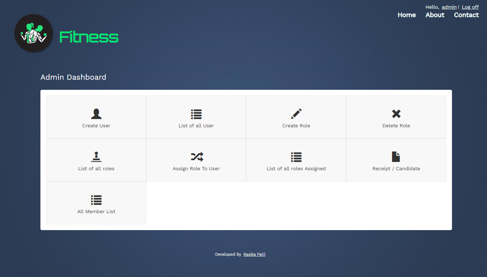
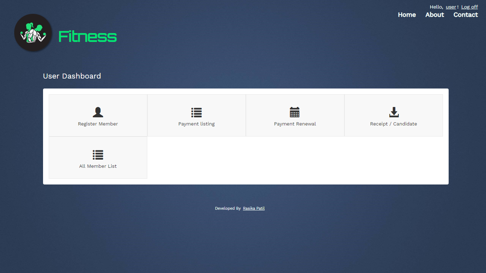

# GymMVC

Overview:
-------------------

GymMVC is a Gym Management System that provides fitness businesses the functionality to manage memberships, payment, renewals and make your gym administration easy. The capabilities of gym management systems include storing member information in a database, managing financial records, products, payment receipts of members & all transactions that occur in Gym. It is a complete gym management solution which will enable you to streamline processes and save time that you can re-invest in other areas of your business! GymMVC systems may integrate with other types of software to perform specific tasks at a higher level. These integrations may include billing software to manage payments and membership dues, transactional email tools to increase interaction between members and managers, or social media marketing tools to increase brand awareness.

Features
-------------------
* Facilitates the data storage, data maintenance and its retrieval for the gym in an igneous way
* Easy-to-use software which handles the customer-staff relationship in an effective manner
* User friendly system that requires minimal user training
* Modern, clean, SEO-optimized and fully responsive Theme based on Bootstrap
* Store the record of the customers, the staff that has the privileges to access, modify and delete any record and service
* Only the staff has the privilege to access any database and make the required changes, if necessary
* PayPAl payment gateway API Integration for easy and secure online payments

 
<h1 align="center">
	
</h1>
<h1 align="center">
	
</h1>
<h1 align="center">
	
</h1>
<h1 align="center">
	
</h1>
 

System requirements
-------------------
* IIS 7+
* ASP.NET 4.5+
* MS SQL Server 2008 Express (or higher)
* Microsoft Visual Studio Ultimate 2012 ([Download](http://www.microsoft.com/en-in/download/details.aspx?id=30678))
* ASP.NET MVC 4

How to install
-------------------
* Download the latest release from the download tab and unzip it to your web folder
* Setup a website in IIS and point the file directory to your published folder
* Follow the database installation instructions and Fire up your browser
* Login Details
   1) Admin  
       UserID : Admin  
       Password : 123456  

  2) System User  
      UserID : User  
       Password : 123456

Database Part
-------------------
1)	Create Database with Name: - GYMDB.

2)	After Creating Database now make changes to ConnectionStrings in Web.Config
    Update this connectionStrings with your Own Data Source and Sql UserName and Password.

3)	After making changes in connectionStrings, Run the Project and it will create Simple Membership Tables as follows:
    1.	Users
    2.	webpages_Membership
    3.	webpages_OAuthMembership
    4.	webpages_Roles
    5.	webpages_UsersInRoles

4)	Now Run Script GYMDB.sql Script.

5)	If you Get Error saying "Membership Table already Exists", just remove Create Scripts for below listed tables 
    1.	Users
    2.	webpages_Membership
    3.	webpages_OAuthMembership
    4.	webpages_Roles
    5.	webpages_UsersInRoles
    Please don't remove Insert Script of these Tables.
    

IIS Link
-------------------
http://localhost/GymOne

      
  

