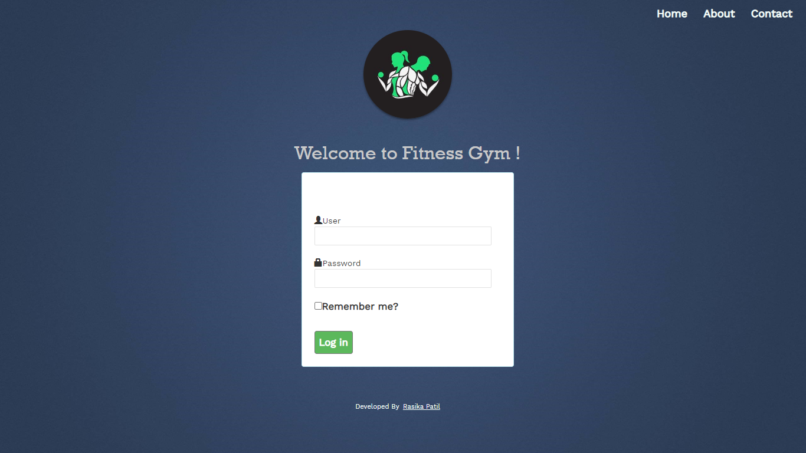

# GymMVC

Overview:
-------------------

GymMVC is gym Management System that provides an easy to use interface for the users and a database for the admin to maintain the records of gym members. This Gym Management system will handle all the necessary and minute details easily and proper database security accordingly to the user. You can keep records on your members, their memberships, employees, products, payroll, receipts of members & all transactions that occur in Gym. It is a complete gym and recreation facility system program which looks after all of your members, memberships and activities.

Features
-------------------
* Facilitates the data storage, data maintenance and its retrieval for the gym in an igneous way
* Easy-to-use software which handles the customer-staff relationship in an effective manner
* User friendly system that requires minimal user training
* Modern, clean, SEO-optimized and fully responsive Theme based on Bootstrap
* Store the record of the customers, the staff that has the privileges to access, modify and delete any record and service
* Only the staff has the privilege to access any database and make the required changes, if necessary

<h1 align="center">
	
</h1>
<h1 align="center">
	
</h1>
<h1 align="center">
	
</h1>

Database Part
-------------------
1)	Create Database with Name: - GYMDB.

2)	After Creating Database now make changes to ConnectionStrings in Web.Config
    Update this connectionStrings with your Own Data Source and Sql UserName and Password.

3)	After making changes in connectionStrings, Run the Project and it will create Simple Membership Tables as follows:
    1.	Users
    2.	webpages_Membership
    3.	webpages_OAuthMembership
    4.	webpages_Roles
    5.	webpages_UsersInRoles

4)	Now Run Script GYMDB.sql Script.

5)	If you Get Error saying "Membership Table already Exists", just remove Create Scripts for below listed tables 
    1.	Users
    2.	webpages_Membership
    3.	webpages_OAuthMembership
    4.	webpages_Roles
    5.	webpages_UsersInRoles
    Please don't remove Insert Script of these Tables.
6)	Login Details
    1.	Admin 
    User ID: Admin 
    Password: 123456
    2.	System User
    User ID: User
    Password: 123456

---------------- IIS Link ----------------
http://localhost/GymOne

      
  

